# Mermaid Diagram Test Suite

A collection of different mermaid diagram types for testing theme color integration.

## Flowchart (Top-Down)

## Flowchart with Subgraphs

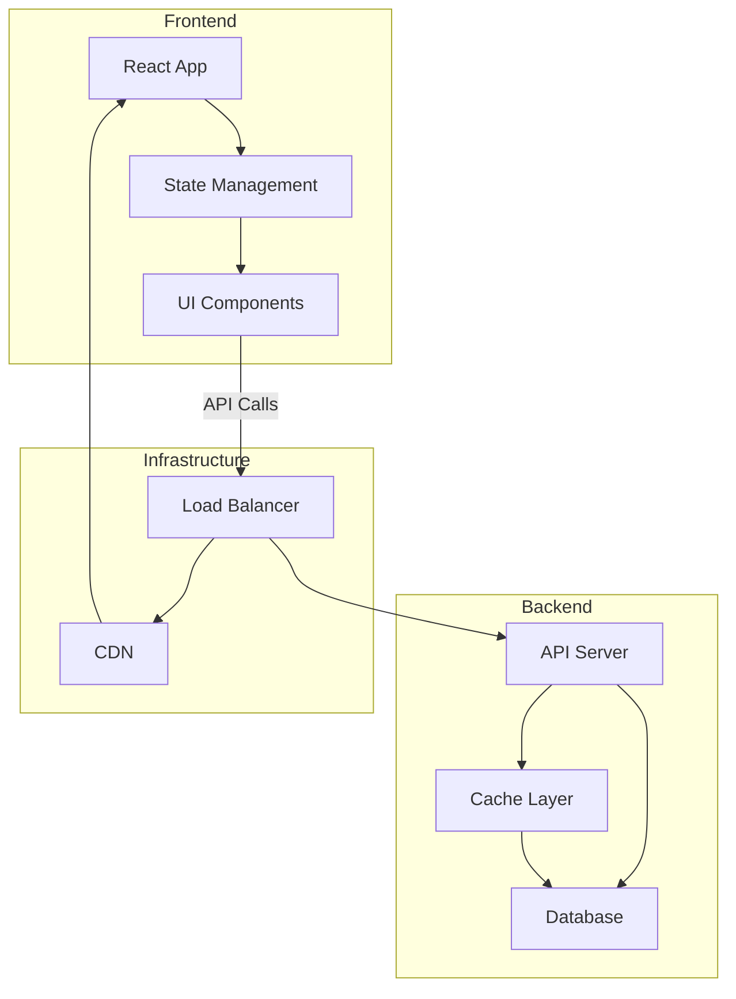

## Sequence Diagram

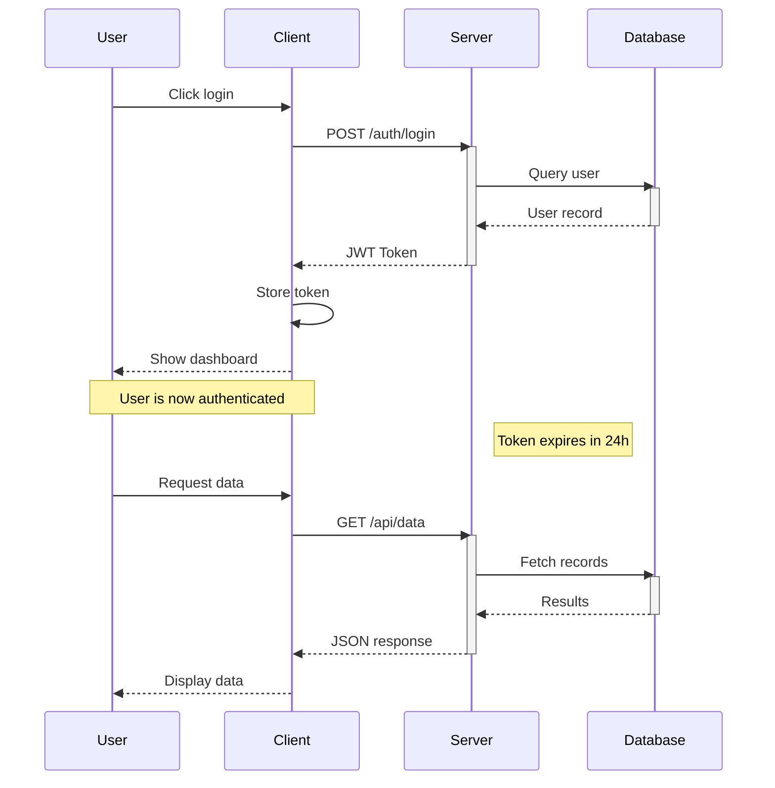

## Pie Chart

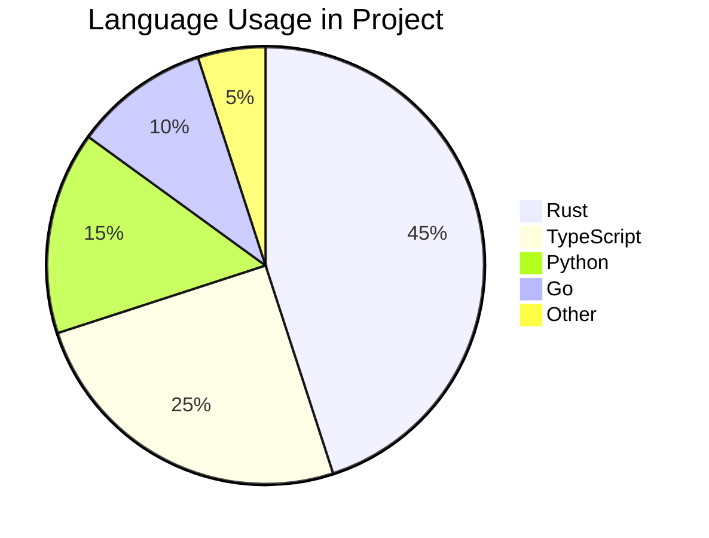

## Git Graph

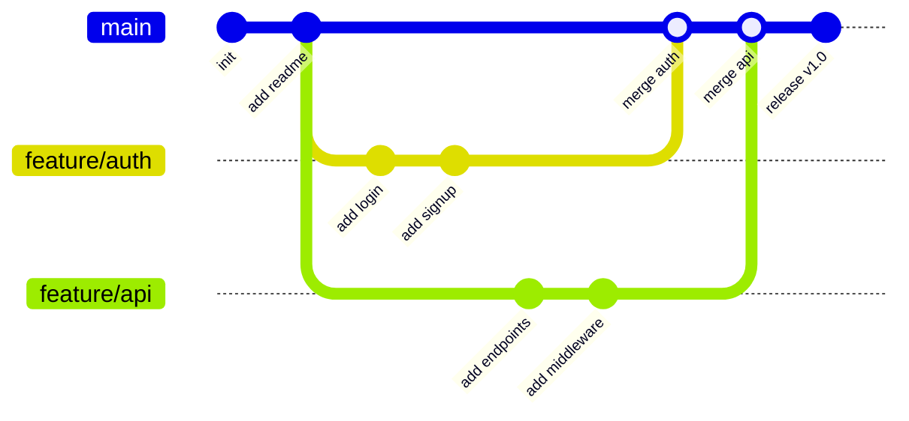

## State Diagram

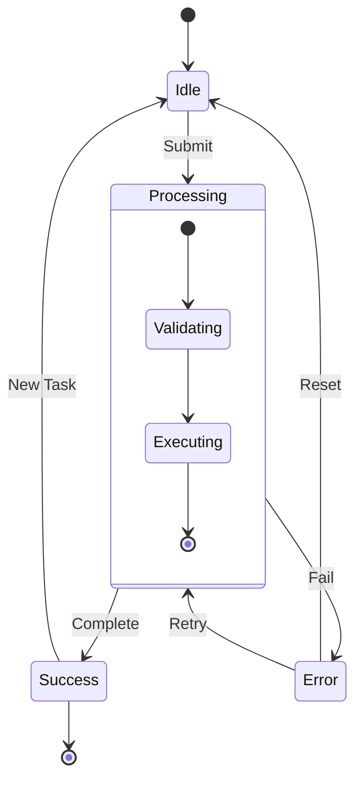

## Class Diagram

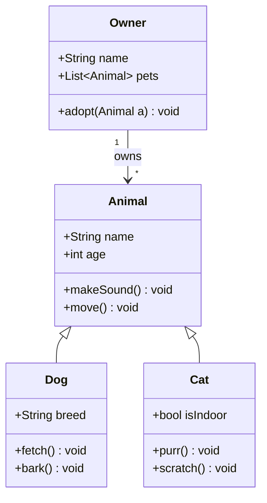

## Entity Relationship Diagram

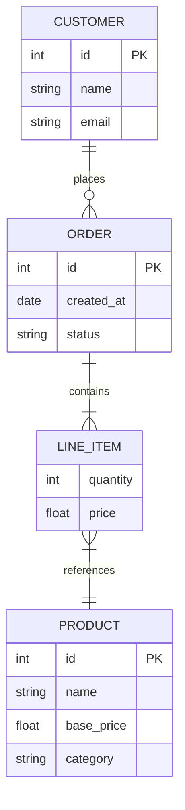

## Gantt Chart

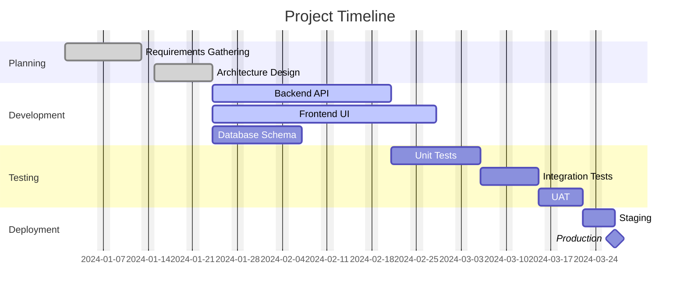

## Flowchart with Styled Nodes

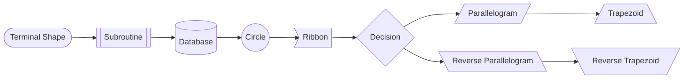

## Sequence Diagram with Loops and Alternatives

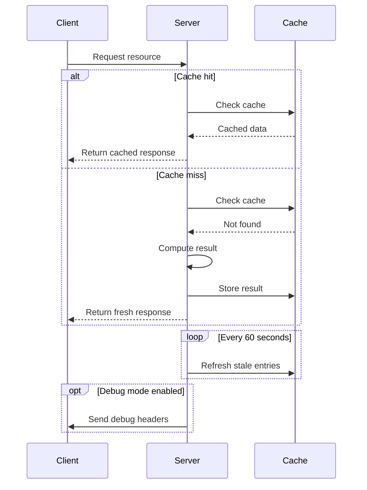

## Flowchart with Long Labels and Edge Labels

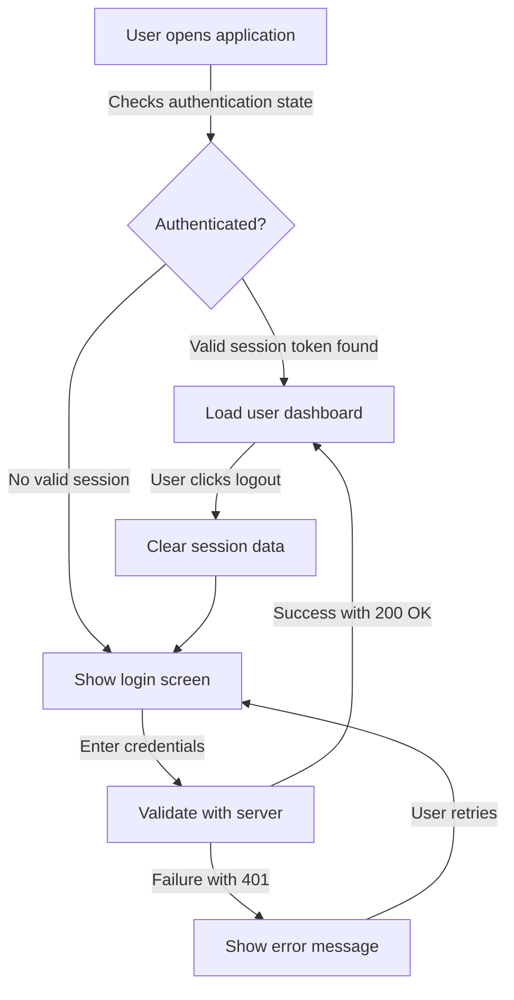
